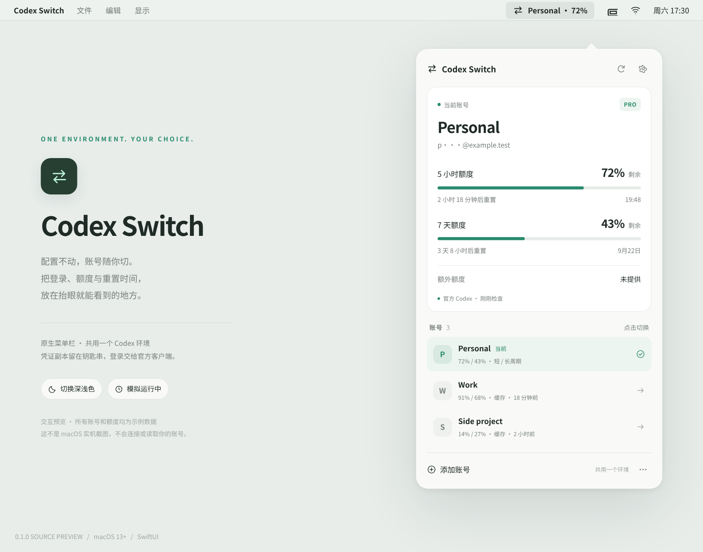

# Codex Switch

**One Codex environment. Several logins. A native Mac menu bar.**

[中文](README.md) · [Security](SECURITY.md) · [Architecture](docs/ARCHITECTURE.md) · [Validation](docs/VALIDATION.md)

macOS 13+ / Swift 5.9+ / SwiftUI / no package dependencies / MIT.

**0.1.0 is a source preview, not a fully verified native release.** Fifty core tests passed on both Linux / Swift 6.2.1 and macOS 26.2 / Swift 6.3.3. The Apple Silicon app has been compiled, ad-hoc signature verified, installed, and launched. UI interactions, real Keychain access, login-item approval, and live OAuth/usage/account switching remain unverified. A Mac build workflow and a smoke-test checklist are included.



## Scope

Keep one existing `CODEX_HOME`, one config, and the same sessions, skills, and MCP settings. Save accounts in the macOS Keychain and choose the live login from a compact menu. Show remaining short/long quota, actual reset times, and credits/reset counts only when supplied by the official Codex app-server.

The app does not proxy requests, scrape browser cookies, handle API keys, implement OAuth token refresh, start model turns, redeem resets, or automatically rotate accounts. It launches your installed official Codex for browser login and active-account usage reads. Other accounts display timestamped **cached** usage rather than silently rotating their tokens.

**No unsafe hot swapping.** A running client may retain an in-memory identity. If Codex processes are detected, a requested switch waits until you close them, then expires after five minutes. No user process is killed. The menu shows the shared **file login**, not proof of every running client's identity. No promise of perpetual login validity or zero account-policy risk is made.

## Build and install

Install Apple development tools (`xcode-select --install`) and the official Codex CLI first. From this directory:

```sh
bash Scripts/install.sh
```

The installer tests, builds the host architecture, ad-hoc signs, and installs `/Applications/Codex Switch.app`. No `sudo`, npm dependencies, credentials, or bundled Codex are required. Quit an existing copy before updating. For just a build or both Mac architectures:

```sh
bash Scripts/build-app.sh
bash Scripts/build-app.sh --universal
```

Artifacts are local/ad-hoc signed, **not Apple notarized**. Never disable system-wide security to run them. Rebuilds can trigger a new Keychain approval prompt; inspect the application before granting it.

## Onboarding

Close Codex processes. Open Accounts & Settings. The existing config needs a top-level `cli_auth_credentials_store = "file"`. When absent, the app can back up the config and prepend that one line, retaining every other byte. Existing `keyring`/`auto` settings require manual review and a fresh official login; no silent migration.

Save the current login. Name and add another account through the official browser flow. The new account stays active and the previous one is retained. An existing browser login is deduplicated without renaming its saved label. Click a row to switch; close any detected CLI, desktop, or IDE Codex backends when asked.

Usage reads use `initialize`, `account/read`, and `account/rateLimits/read` over local stdio. Automatic interval: five minutes. Manual throttle: fifteen seconds. Missing values remain unknown. The UI never assumes a passed reset means 100%, and never labels credits as currency. The linked web usage page uses the browser's separate login.

Default preferences: system language, masked email, active-account quota in the menu bar. English and Chinese are included, along with optional launch at login. Select a custom official CLI executable in settings if an nvm install cannot be found.

## Client scope

The primary target is the official CLI using shared file-based ChatGPT OAuth. Browser sessions, API keys, provider lists, proxy endpoints and enforced workspace policies are not changed. Stop other switchers. Desktop/IDE clients must actually honor this shared credential mode and be restarted; their specific versions have not been verified. The menu does not claim to inspect their in-memory identities.

## Storage and maintenance

Archived credentials are non-synchronizing ordinary macOS Keychain items under `cc.atou.codex-switchbar.credentials`. The official active `auth.json` is still a sensitive 0600 file. `~/Library/Application Support/Codex Switch` stores private account metadata, cached usage, and a recovery marker, not OAuth tokens. Workspace and user identity jointly identify an account. This avoids merging different users of one workspace.

Switching saves the current token, validates the target, journals the operation, rechecks processes and live bytes, and atomically replaces the login. Crash recovery reconciles with the current file instead of replaying a stale backup. The advisory lock only coordinates this app's instances; it cannot force official clients or other switchers to cooperate. Stop other switchers. Shared history is **not** work/personal data isolation.

A custom existing home can be set globally after quitting the app:

```sh
defaults write cc.atou.codex-switchbar codexHome -string "/absolute/path/to/existing/home"
```

No per-account homes are created. Symlink homes/credential files and ambiguous TOML layouts are rejected rather than guessed. Forgetting an account deletes only the saved copy; it does not sign out Codex or remove history.

```sh
swift test
python3 Scripts/check-source.py
```

The native app, domain core, and official-CLI protocol are separate modules. There is no Xcode project to synchronize or third-party dependency graph to update. See the architecture and validation documents before altering authentication behavior.

## Publication

No remote repository has been created by this source delivery. On a fresh extracted directory, with GitHub CLI installed and authenticated as `atou42`, run:

```sh
bash Scripts/publish.sh
```

This scans source, creates a **new public** `atou42/codex-switchbar`, and pushes an initial commit. Existing repositories and Git history are refused. The workflow then performs Mac testing and packaging; it does not deploy or publish a Release. Never paste credentials into chat, issues, or the repository.

Independently implemented. UI inspiration and official references are listed in [REFERENCES](docs/REFERENCES.md). Not affiliated with OpenAI.

## Terminal control

The installer adds `~/.local/bin/codex-switch`; include that directory in PATH. Commands: `start`, `stop`, `list`, `setup`, `save "Personal"`, `add "Work"`, `switch "Work"`, `status`, `cancel`, `usage`, `rename "Work" "Office"`, and `remove "Office"`. Add `--json` for structured output, or run `--help`.

Commands control the same menu-bar app and account store. Account commands launch it in the background if needed; `start` opens settings. `stop` and `status` do not launch a stopped app. Login and switching can be asynchronous: `login_pending`, `switch_queued`, and `working` are pending states, not completion. Use `status` to check the eventual result and active account. Immediate errors return a nonzero exit code. Adding requires Codex clients to be closed. Duplicate names require an exact account ID from `list`. Credentials are never returned.

The owner-only local socket checks both peers' user IDs. An occupied socket path is never automatically deleted, even after a crash; investigate the existing instance/state first.
